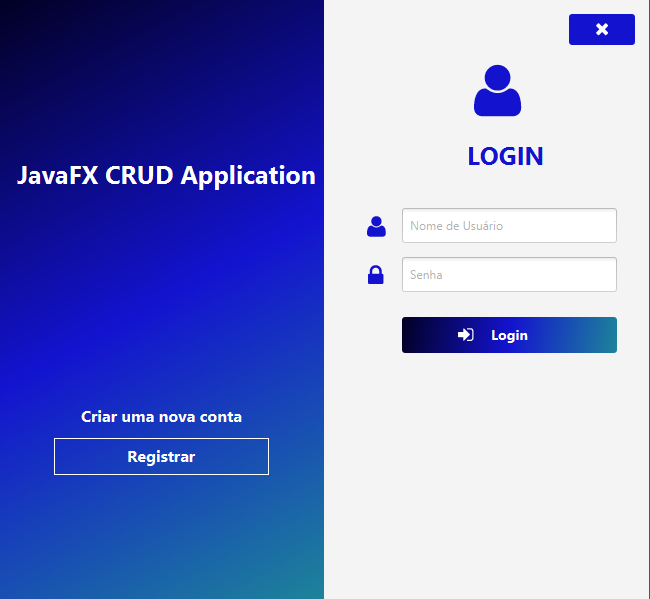
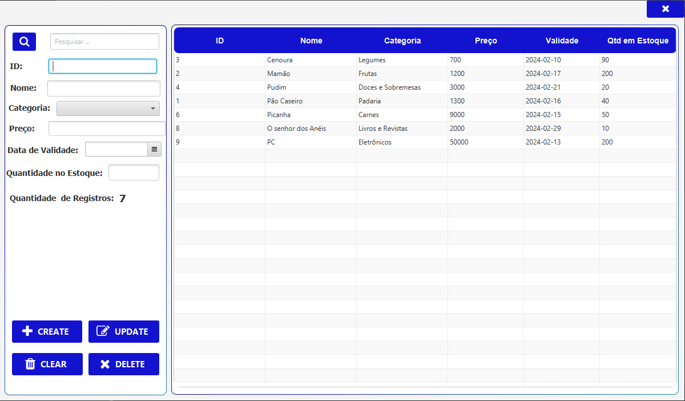

# JavaFX CRUD Application

Este é um aplicativo CRUD (Create, Read, Update, Delete) desenvolvido em JavaFX. O aplicativo utiliza a biblioteca JavaFX para criar uma interface gráfica de usuário interativa, permitindo operações básicas de gerenciamento de dados.

## Funcionalidades:
- Create: Adicione novos registros à sua base de dados.
- Read: Visualize e consulte os dados existentes.
- Update: Faça alterações nos registros existentes.
- Delete: Remova registros da base de dados.
- Registrar Conta: Registre novas contas no sistema.
- Logar Conta: Faça login em contas existentes.

## Tecnologias Utilizadas:
| Tecnologia           | Descrição  |
|----------------------|------------|
| JavaFX               | Biblioteca gráfica para o desenvolvimento de interfaces de usuário em Java. |
| ControlsFX           | Conjunto de bibliotecas adicionais para melhorar a experiência do usuário no JavaFX. |
| PostgreSQL Driver    | Driver JDBC para comunicação entre Java e o banco de dados PostgreSQL. |
| JDK                  | Java Development Kit - Conjunto de ferramentas essenciais para o desenvolvimento em Java. |
| Eclipse              | Ambiente de desenvolvimento integrado (IDE) para Java. |
| PostgreSQL           | Banco de dados relacional de código aberto, conhecido por sua confiabilidade e desempenho. |

## Classe Modelo: 
Produto

### Atributos da classe:
- ID
- Nome
- Categoria
- Preço(Em centavos)
- Data de Validade
- Quantidade em Estoque

## Scripts SQL para criação das tabelas:

### Usuários:

CREATE TABLE usuarios(
	id SERIAL PRIMARY KEY,
	nome VARCHAR NOT NULL UNIQUE,
	senha VARCHAR NOT NULL
)

### Produtos:

CREATE TABLE produtos(
	id SERIAL PRIMARY KEY,
	nome VARCHAR NOT NULL UNIQUE,
	categoria VARCHAR NOT NULL,
	preco INT NOT NULL,
	data_validade DATE NOT NULL,
	qtd_estoque INT NOT NULL
)

## Imagens

